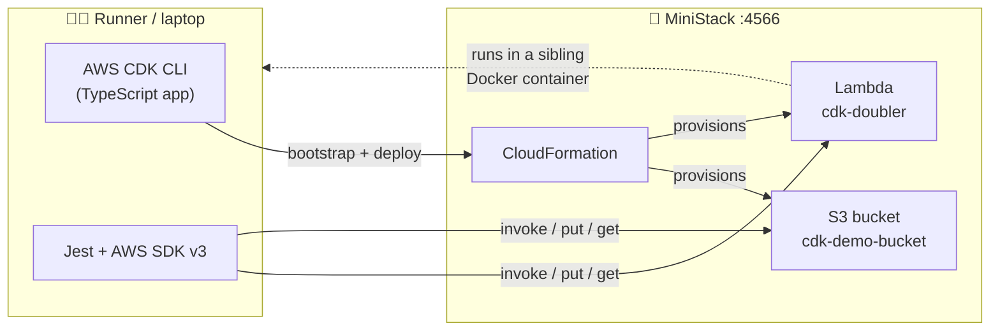

<div align="center">

# 🪐 e2e-ministack

**End-to-end AWS CDK testing — no cloud account, no bill, no waiting.**

Deploy a real CDK stack and run integration tests against it entirely on your laptop (or in CI), using [MiniStack](https://github.com/ministackorg/ministack) as a local AWS emulator.

[](https://github.com/scottschreckengaust/e2e-ministack/actions/workflows/aws-integration-tests.yml)
[](https://github.com/scottschreckengaust/e2e-ministack/actions/workflows/security.yml)


[](LICENSE)

</div>

---

## ✨ What you get

- 🏗️ A minimal **CDK stack** (TypeScript): an S3 bucket + a Node.js 24 Lambda.
- 🧪 **Jest integration tests** that hit the *deployed* resources through the AWS SDK v3 — not mocks.
- 🐳 **MiniStack** standing in for AWS locally: `bootstrap` → `deploy` → `test` → `destroy`, on port `4566`.
- 🤖 A **GitHub Actions workflow** that runs the exact same loop on every push.

## 🗺️ How it fits together



## 🚀 Quickstart

> [!IMPORTANT]
> Requires **Docker** (Linux host) and **Node 24** (`mise install` reads [`mise.toml`](mise.toml)).

```bash
# 1️⃣ Start MiniStack (flags matter — see the table below)
docker run -d --name ministack --network host \
  -v /var/run/docker.sock:/var/run/docker.sock \
  -e LAMBDA_EXECUTOR=docker -e MINISTACK_RDS_PUBLIC_ENDPOINT=1 -e MINISTACK_HOST=localhost \
  ministackorg/ministack:full

# 2️⃣ Point the AWS toolchain at MiniStack (both endpoint vars required)
export AWS_ENDPOINT_URL=http://localhost:4566 AWS_ENDPOINT_URL_S3=http://localhost:4566 \
  AWS_ACCESS_KEY_ID=test AWS_SECRET_ACCESS_KEY=test \
  AWS_REGION=us-east-1 AWS_DEFAULT_REGION=us-east-1 \
  CDK_DEFAULT_ACCOUNT=000000000000 CDK_DEFAULT_REGION=us-east-1

# 3️⃣ Build, deploy, test
npm ci
npm run build
npm run bootstrap
npm run deploy
npm test
```

```console
PASS test/integration.test.ts
  ✓ invokes the deployed Lambda and gets the doubled value
  ✓ round-trips an object through the deployed S3 bucket
```

## 📦 npm scripts

| Script | Does |
| --- | --- |
| `npm run build` | `tsc` compile |
| `npm run bootstrap` | `cdk bootstrap` the `CDKToolkit` stack into MiniStack |
| `npm run deploy` | `cdk deploy --require-approval never` |
| `npm test` | Jest integration tests against deployed resources |
| `npm run destroy` | `cdk destroy --force` |

Reset MiniStack state between runs (cheaper than restarting): `curl -X POST http://localhost:4566/_ministack/reset`

## 🧩 Project layout

```text
bin/app.ts                 # CDK entrypoint (fixed account/region)
lib/ministack-stack.ts     # the stack: S3 bucket + Lambda
lambda/index.js            # function under test (doubles event.n)
test/integration.test.ts   # Jest + AWS SDK v3, points at AWS_ENDPOINT_URL
.github/workflows/         # CI: same bootstrap → deploy → test loop
```

## ⚠️ Gotchas worth knowing

These were learned by running it, not from docs — the defaults bite in non-obvious ways:

| Gotcha | Why / fix |
| --- | --- |
| 🚫 **Not** a GH Actions `services:` container | Lambda/ECS/RDS spawn *sibling* Docker containers; a service container can't join the host network. Run MiniStack as a `docker run` step instead. |
| 🩺 Don't set a `curl` health check | The image has no `curl`/`wget` — it ships its own python `HEALTHCHECK`. A curl override goes `unhealthy` and blocks the job. |
| 🌐 `--network host` is required | Makes MiniStack's loopback the host so sibling RDS/Lambda ports resolve (Linux-only; fine on `ubuntu-latest`). |
| 🔑 Set **both** `AWS_ENDPOINT_URL` *and* `AWS_ENDPOINT_URL_S3` | Bare `cdk` (CLI ≥ 2.1000) needs the S3-specific var; S3 virtual-host addressing can't be inferred. No `cdklocal` wrapper needed. |
| 🪣 Avoid `autoDeleteObjects: true` | Its custom-resource Lambda stalls the deploy against the emulator. Use `cdk destroy` / reset. |

## 🔒 Security checks

A defense-in-depth set of gates runs in CI (see [`security.yml`](.github/workflows/security.yml)); most also run locally.

| Layer | Tool | Scope |
| --- | --- | --- |
| CDK best practices | **cdk-nag** (AwsSolutions) | Fails `cdk synth` on violations — wired into the build |
| Lint | **ESLint** + typescript-eslint | TypeScript construct code |
| IaC | **checkov** + **cfn-lint** | Synthesized CloudFormation (`cdk.out`) |
| Dependencies | **npm audit**, **OSV-Scanner**, **Grype** | Lockfile + filesystem CVEs |
| SAST | **Semgrep**, **CodeQL** | JS/TS source |
| Secrets | **Gitleaks** | Full git history |
| Actions hardening | **zizmor** + **actionlint** | The workflow files themselves |
| Threat model | **threat-composer** | `threat-model.tc.json` ([how to use](docs/THREAT-MODELING.md)) |

The stack is hardened to pass cdk-nag and checkov cleanly (TLS, encryption, least-privilege IAM, DLQ, KMS-encrypted logs). All GitHub Actions are pinned to commit SHAs with least-privilege `permissions`.

## 📚 References

- [MiniStack](https://github.com/ministackorg/ministack) — the local AWS emulator (MIT)
- [AWS CDK](https://docs.aws.amazon.com/cdk/v2/guide/home.html) · [GitHub Actions service containers](https://docs.github.com/en/actions/using-containerized-services/about-service-containers)

## 📄 License

[MIT](LICENSE) © Scott Schreckengaust
